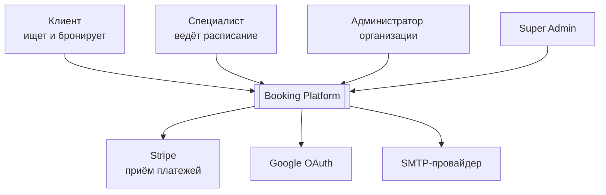
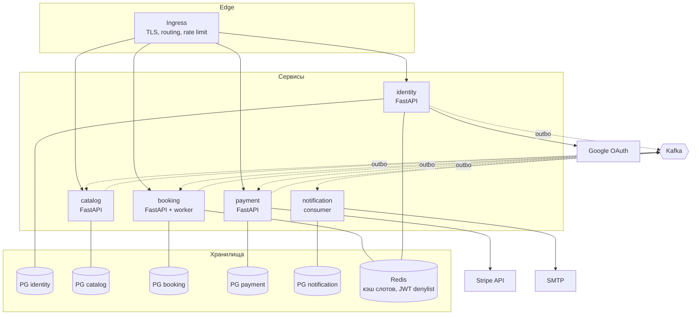

# Архитектура

## 1. Контекст (C4 level 1)

## 2. Контейнеры (C4 level 2)

**Синхронных вызовов между сервисами нет.** Единственная межсервисная синхронная
зависимость — загрузка публичного ключа с JWKS-эндпоинта `identity`, и та кэшируется.
Всё остальное взаимодействие — асинхронное, через брокер.

## 3. Владение данными

Правило: у каждой сущности ровно один владелец. Остальные сервисы получают
проекции через события и никогда не пишут в чужие данные. Межсервисных внешних
ключей не существует.

| Данные | Владелец | Кто держит проекцию |
|---|---|---|
| Пользователи, credentials, роли, permissions | `identity` | — |
| Организации, специалисты, услуги, цены | `catalog` | `booking` (как `offerings`) |
| Рабочие часы, исключения расписания | `booking` | — |
| Брони | `booking` | — |
| Платежи, состояние в Stripe | `payment` | `booking` (только статус в брони) |
| Уведомления, шаблоны | `notification` | — |

Обоснование границы «рабочие часы принадлежат `booking`, а не `catalog`» — см.
[ADR-0001](adr/0001-microservice-boundaries.md).

## 4. Почему сервисы именно такие

| Сервис | Причина быть отдельным |
|---|---|
| `identity` | отдельный контур безопасности; должен работать, когда лежит остальное |
| `catalog` | конфигурация тенанта, read-heavy, редко меняется — другой профиль нагрузки |
| `booking` | ядро домена; единственная транзакционная граница главного инварианта |
| `payment` | внешняя система с чужой моделью отказов; деньги требуют изоляции |
| `notification` | чистый consumer; деградирует, не влияя на бронирование |

Сервисы, которых сознательно **нет**:

- **`calendar`** — расчёт слотов не имеет собственного состояния и не может быть
  отделён от инварианта непересечения броней.
- **`user`** отдельно от `auth` — делят одну сущность, меняются и деплоятся вместе.
- **`billing`** — монетизация через комиссию с платежа, отдельная подписочная модель не нужна.
- **`reviews`** — вне MVP.

## 5. Сквозные механизмы (service chassis)

Общая внутренняя библиотека, содержащая **только инфраструктуру**:

- структурное JSON-логирование с `trace_id` / `request_id`
- OpenTelemetry: трассировка HTTP, БД, брокера
- метрики Prometheus (RED: rate, errors, duration)
- middleware аутентификации: валидация JWT по кэшированному JWKS, проверка denylist
- transactional outbox: запись, relay, публикация
- идемпотентное потребление событий (`processed_events`)
- health/readiness-эндпоинты, единый формат ошибок, загрузка конфигурации

**Доменные модели и DTO чужих сервисов в шасси запрещены.** Дублирование доменных
типов между сервисами — не дефект, а изоляция.

## 6. Наблюдаемость

OpenTelemetry как единый источник телеметрии → Prometheus (метрики),
Loki (логи), Tempo (трейсы), Grafana (единый UI). Переход трейс → логи → метрики
по `trace_id`. Обоснование против ELK — [ADR-0008](adr/0008-observability.md).

## 7. Развёртывание

Локальный кластер kind/k3d. CI (GitHub Actions): линт, тесты, сборка образа, push
в ghcr.io, обновление тега в манифестах. CD: ArgoCD внутри кластера тянет манифесты
из репозитория. Пайплайну не нужен доступ внутрь локальной сети.
