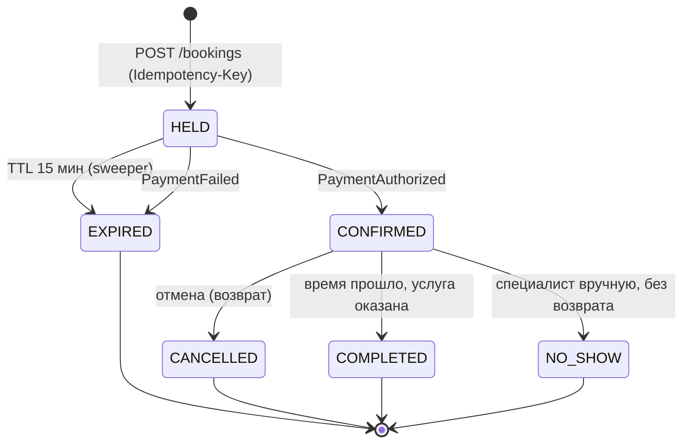
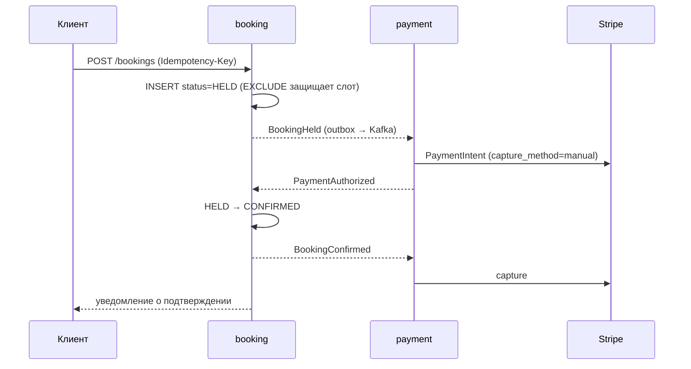

# Доменная модель

## 1. Агрегаты

| Агрегат | Содержит | Транзакционная граница |
|---|---|---|
| `Booking` | бронь: специалист, клиент, снапшот услуги, интервал, статус, платёж | да |
| `SpecialistSchedule` | недельный шаблон рабочих часов + исключения | да |
| `Availability` | вычисляемая read-модель | нет состояния |

`Availability` не является ни агрегатом, ни сервисом: это чистая функция
`(расписание, исключения, брони, длительность услуги) → слоты`.

## 2. Главный инвариант

> Два бронирования одного специалиста в статусах `HELD` или `CONFIRMED`
> не могут пересекаться во времени с учётом буфера.

Обеспечивается ограничением целостности PostgreSQL, а не кодом приложения:

```
EXCLUDE USING gist (specialist_id WITH =, time_range WITH &&)
  WHERE (status IN ('HELD','CONFIRMED'))
```

Буфер между записями включён в сохранённый интервал: `[start, end + buffer)`.
Нарушение `ExclusionViolation` перехватывается в репозитории и транслируется
в доменное исключение `SlotAlreadyTaken` → HTTP 409.

Обоснование и отвергнутые альтернативы — [ADR-0002](adr/0002-no-double-booking-invariant.md).

## 3. Модель времени

- В БД все моменты — `timestamptz`, всегда UTC.
- Рабочие часы хранятся как **локальное время + IANA-зона специалиста**
  (`Europe/Warsaw`, не `UTC+2`): смещение — свойство даты, а не зоны.
- Слоты генерируются в локальной зоне, затем конвертируются в UTC.
- DST: несуществующее локальное время слотов не порождает; дублирующееся —
  порождает один слот по первому вхождению.
- Зона клиента — только представление, в расчётах не участвует.

## 4. Жизненный цикл брони



Правила переходов:

- отмена клиентом — не позже `min_lead_time` до начала, полный возврат;
- отмена специалистом — в любой момент, полный возврат;
- `NO_SHOW` — только специалист, возврат не производится;
- **перенос** — не пара «отмена + создание», а одна транзакция внутри агрегата:
  старый интервал освобождается и новый занимается атомарно, платёж не трогается;
- **`CONFIRMED` → `COMPLETED`** выполняет фоновая задача через 60 минут после
  окончания интервала, если не проставлен `NO_SHOW` (ADR-0014);
- деактивация специалиста или услуги **не отменяет** существующие подтверждённые
  брони: новые не создаются, массовая отмена — явное действие `ORG_ADMIN` (ADR-0014).

## 5. Сага оплаты

Оркестратор — `booking` (владеет состоянием брони и таймаутом удержания).
`payment` — исполнитель, знает про Stripe и ничего не знает про брони.



**Authorize + manual capture, а не немедленное списание.** Отмена авторизации —
не возврат: нет движения денег, нет комиссии за refund, нет ожидания у клиента.
Возврат остаётся только для настоящих отмен подтверждённой брони.

### Компенсация: платёж авторизован после истечения удержания

1. `booking` получает `PaymentAuthorized` для брони в статусе `EXPIRED`;
2. пытается повторно занять интервал в той же транзакции;
3. успех → `CONFIRMED`, обычный поток;
4. `ExclusionViolation` (слот занят) → публикует `PaymentVoidRequested`,
   `payment` отменяет авторизацию в Stripe.

## 6. Идемпотентность

| Контур | Механизм |
|---|---|
| Создание брони | клиентский `Idempotency-Key`, уникальный индекс |
| Вебхуки Stripe | дедупликация по `provider_event_id` |
| Потребление событий | `processed_events (event_id, consumer)` |

At-least-once доставка означает, что дубликаты будут гарантированно, а не гипотетически.

## 7. Схемы данных

Эскиз: типы и ограничения, не миграции.

### Общее для всех сервисов (часть шасси)

```
outbox            id, aggregate_type, aggregate_id, event_type, payload jsonb,
                  version, occurred_at, published_at NULL, partition_key
processed_events  event_id, consumer, processed_at            PK(event_id, consumer)
```

`outbox` пишется в одной транзакции с изменением состояния; relay-процесс публикует
неотправленные строки. Публикация в брокер из бизнес-кода запрещена.

### identity

```
users            id, email citext UNIQUE, password_hash NULL, full_name, phone NULL,
                 avatar_url NULL, timezone, status, created_at, updated_at
oauth_accounts   id, user_id, provider, provider_user_id
                 UNIQUE(provider, provider_user_id)
permissions      id, code UNIQUE
roles            id, code UNIQUE, is_system
role_permissions role_id, permission_id                       PK(role_id, permission_id)
user_roles       id, user_id, role_id, tenant_id NULL, granted_at, granted_by_user_id NULL
                 UNIQUE NULLS NOT DISTINCT (user_id, role_id, tenant_id)
refresh_tokens   id, user_id, token_hash, family_id, issued_at, expires_at, revoked_at,
                 replaced_by NULL, user_agent, ip
audit_log        id, occurred_at, action, actor_user_id NULL, subject_user_id,
                 role_code, tenant_id NULL, detail jsonb
```

`user_roles.tenant_id` обязателен по смыслу: `SPECIALIST` и `ORG_ADMIN` — роли внутри
конкретной организации; один человек может быть админом в одной и клиентом в другой.
`NULL` только для `SUPER_ADMIN`.

Отсюда и суррогатный ключ вместо составного: колонка первичного ключа в PostgreSQL
всегда `NOT NULL`, поэтому `PK(user_id, role_id, tenant_id)` при обнуляемом
`tenant_id` невыразим. Уникальность гранта обеспечивает ограничение, и оно объявлено
`NULLS NOT DISTINCT` — иначе каждый `NULL` считается отдельным значением и один и тот
же платформенный грант вставился бы неограниченное число раз.

`audit_log.occurred_at` заполняется `clock_timestamp()`, а не `now()`: второе — момент
начала транзакции, и длинная транзакция проставила бы всем записям время своего старта
вместо времени действия.

### catalog

```
organizations       id, name, slug UNIQUE, owner_user_id, timezone, status, created_at
specialists         id, organization_id, user_id, display_name, bio, status
                    UNIQUE(organization_id, user_id)
services            id, organization_id, name, description, duration_min, buffer_min,
                    price_amount numeric(12,2), currency, is_active
specialist_services specialist_id, service_id, price_override NULL,
                    duration_override NULL, is_active    PK(specialist_id, service_id)
```

### booking

```
offerings           specialist_id, service_id, organization_id, duration_min, buffer_min,
                    price_amount, currency, is_active, timezone, version, updated_at
                    PK(specialist_id, service_id)                       -- проекция catalog
working_hours       id, specialist_id, weekday smallint, start_time time, end_time time
schedule_exceptions id, specialist_id, kind (TIME_OFF|EXTRA_SHIFT),
                    starts_at_local timestamp, ends_at_local timestamp, reason
bookings            id, organization_id, specialist_id, client_user_id, service_id,
                    time_range tstzrange, service_duration_min,
                    price_amount, currency, status, hold_expires_at NULL,
                    payment_id NULL, idempotency_key, cancel_reason NULL,
                    cancelled_by NULL, created_at, updated_at, version

  EXCLUDE USING gist (specialist_id WITH =, time_range WITH &&)
    WHERE (status IN ('HELD','CONFIRMED'))
  UNIQUE (idempotency_key)
```

Индексы:

| Индекс | Назначение |
|---|---|
| gist от `EXCLUDE` | инвариант + выборка броней за период |
| `(specialist_id, status)` partial `HELD/CONFIRMED` | загрузка занятости для расчёта слотов |
| `(hold_expires_at)` partial `status='HELD'` | sweeper истёкших удержаний |
| `(client_user_id, created_at DESC)` | «мои записи» |
| `(organization_id, created_at DESC)` | отчёты ORG_ADMIN |

### payment

```
payments        id, booking_id UNIQUE, organization_id, client_user_id, amount, currency,
                status, provider, provider_intent_id, idempotency_key UNIQUE,
                failure_reason NULL, created_at, updated_at
webhook_events  provider_event_id UNIQUE, type, payload jsonb, received_at, processed_at
```

### notification

```
notifications   id, user_id, channel, template_code, payload jsonb, status,
                attempts, last_error NULL, scheduled_at, sent_at NULL
templates       code, channel, locale, subject, body        PK(code, channel, locale)
```

## 8. Алгоритм расчёта доступности

```
вход: specialist_id, service_id, date_from, date_to (≤ 30 дней)

1. offering → duration, buffer, timezone; is_active=false → пусто
2. развернуть working_hours по дням диапазона в ЛОКАЛЬНОЙ зоне
3. вычесть TIME_OFF, добавить EXTRA_SHIFT
4. локальное → UTC с учётом DST
     несуществующее локальное время  → интервал усечь
     дублирующееся (осенний перевод) → первое вхождение
5. вычесть занятые интервалы (HELD|CONFIRMED), уже содержащие буфер
6. нарезать шагом grid_step (15 мин), оставить слоты под duration + buffer
7. отсечь прошлое и всё раньше min_lead_time (2 ч); горизонт 60 дней
8. вернуть в UTC; отображение в зоне клиента — на клиенте
```

Шаги 2–4 — единственное место в системе, где существует локальное время.

**Кэш:** `avail:{specialist_id}:{date}`, TTL 60 с, инвалидация по событиям брони и
изменениям расписания. Кэш обслуживает только чтение. Путь записи не обращается к
Redis — корректность обеспечивает `EXCLUDE` в транзакции. Полная потеря Redis
замедляет систему, но не нарушает её.

## 9. Публичные контракты `/api/v1`

| Метод | Эндпоинт | Сервис | Право |
|---|---|---|---|
| POST | `/auth/register` `/auth/login` `/auth/refresh` `/auth/logout` | identity | — |
| GET | `/auth/oauth/google` `/auth/oauth/google/callback` | identity | — |
| GET PATCH | `/users/me` | identity | — |
| POST GET PATCH | `/organizations` `/organizations/{id}` | catalog | manage_organization |
| POST GET DELETE | `/organizations/{id}/specialists` | catalog | manage_users |
| POST GET PATCH | `/services` `/services/{id}` | catalog | create_service, update_service |
| PUT GET | `/specialists/{id}/working-hours` | booking | manage_schedule |
| POST GET DELETE | `/specialists/{id}/exceptions` | booking | manage_schedule |
| GET | `/availability?specialist_id&service_id&from&to` | booking | публичный |
| POST | `/bookings` (`Idempotency-Key`) | booking | create_booking |
| GET | `/bookings` `/bookings/{id}` | booking | scoped по роли |
| POST | `/bookings/{id}/cancel` `/bookings/{id}/reschedule` | booking | cancel_booking |
| POST | `/webhooks/stripe` | payment | подпись Stripe |

`POST /bookings` → `201` со статусом `HELD`, `payment_client_secret`, `hold_expires_at`.
Синхронного ожидания оплаты в API нет: подтверждение приходит вебхуком.
